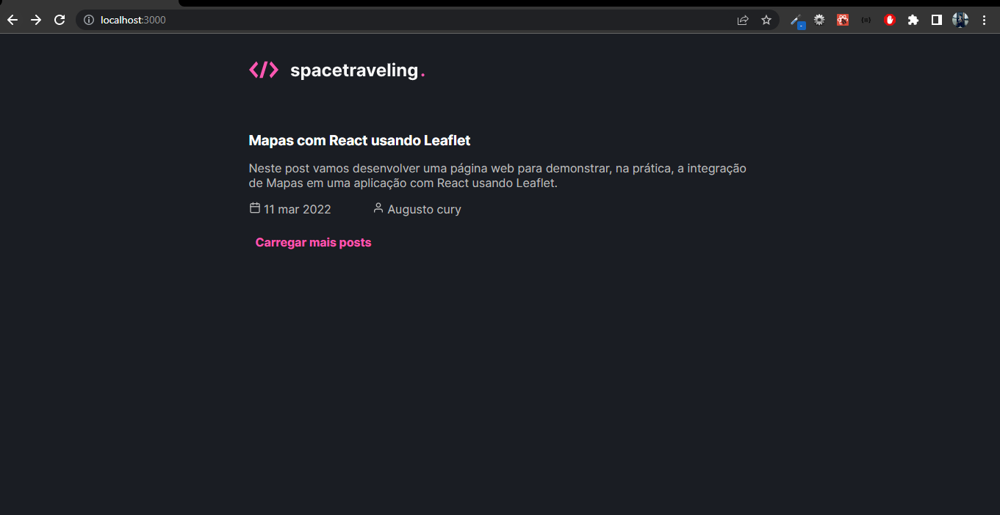
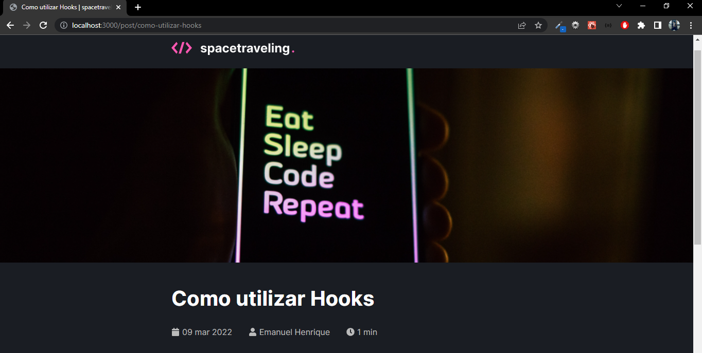

#  Desafio - Criando um projeto do zero

Esse desafio tinha como objetivo criar um blog usando Next, Prismic CMS e Typescript.
Além disso, era obrigatório utilizar o seguinte layout do figma: https://www.figma.com/file/0Y26j0tf1K2WB5c1ja5hov/Desafios-M%C3%B3dulo-3-ReactJS/duplicate

# Sobre o site

## Página inicial:

Essa página contém a logo do site e os posts disponíveis para acesso, os posts são exibidos de um em um e cada post possui um título, um subtitítulo, o autor e a data de criação. caso queira carregar mais posts basta clicar no botão "Carregar mais posts".

## Página post
Ao clicar em um determinado post o usuário é redirecionado para o path do post.
Nessa página contém a logo do site, a imagem, o título principal do post e o título secundário, a data de criação, o autor, tempo estimado de leitura e o contéudo do post.

 
 

# Sobre o código
- Estilização feita usando sass
- Todas as páginas estão dentro da pasta pages, o código do arquivo index reflete a página inicial, e post/[ slug ] possui código que reflete o caminho do post que foi clicado na página inicial.
 
 

# Tecnologias
* Next
* date-fns
* react-icons
* Typescript
* sass

 

## [Video exemplo](https://youtu.be/SFOLK7xCplg)
